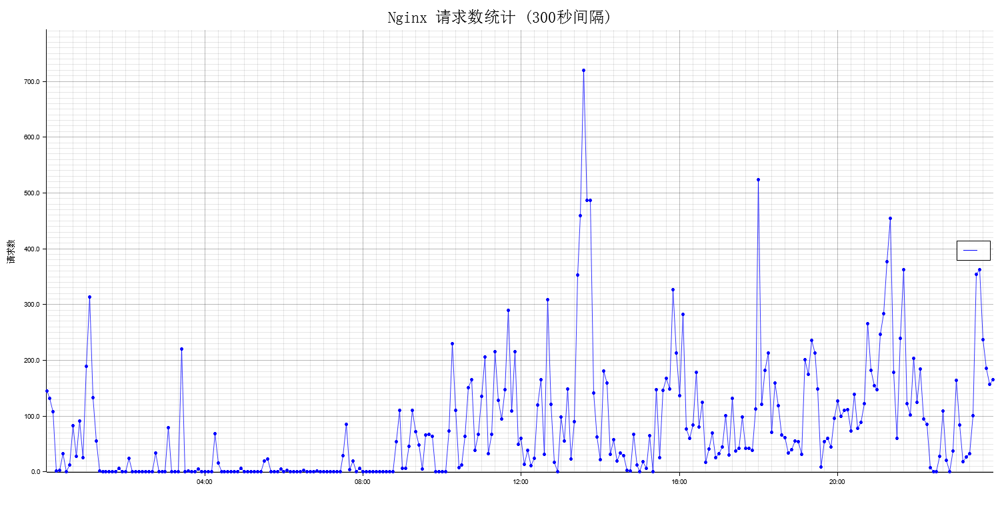
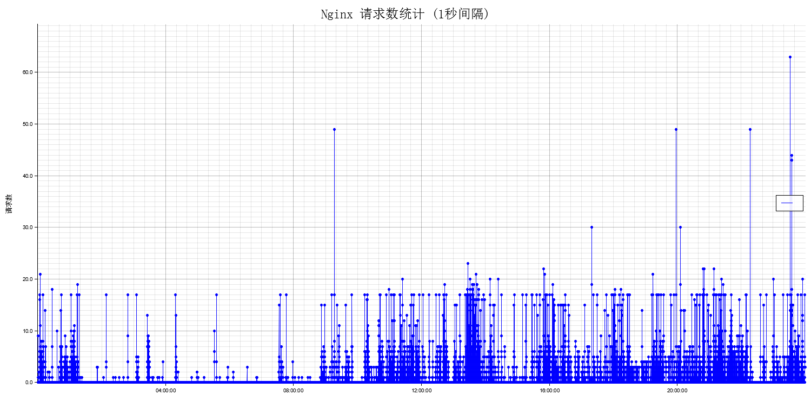

# Nginx日志QPS统计工具

[](https://www.rust-lang.org/)
[](https://opensource.org/licenses/MIT)

用于分析Nginx访问日志并生成请求量时间序列图的Rust命令行工具。

## 功能特性

- 解析Nginx默认日志格式的时间戳
- 支持自定义统计时间间隔（秒级精度）
- 自动生成可视化折线图（PNG格式）
- 自动识别时间范围
- 支持中文字符显示

## 安装

1. 确保已安装[Rust工具链](https://www.rust-lang.org/tools/install)
2. 克隆本仓库：
```bash
git clone https://github.com/47sang/qps_rust.git
```
3. 构建项目：
```bash
cargo build --release
```

## 使用方法

```bash
cargo run --release -- \
    -l <日志文件路径> \
    -i <统计间隔(秒)> \
    -o <输出图片路径>
```

**参数说明**：
- `-l/--log-file`: Nginx访问日志文件路径（必需）
- `-i/--interval`: 统计时间间隔（秒，默认1秒）
- `-o/--output`: 输出图表文件名（默认qps_chart.png）

**示例**：
```bash
cargo run -- -l info-2025-03-18.log -i 300 -o 5min_qps.png
cargo run --release -- -l access.log -i 300 -o 5min_qps.png
```

## 日志格式要求
工具需要解析Nginx默认日志格式中的时间字段，日志格式示例：
```
127.0.0.1 - - [10/Jul/2023:14:23:45 +0800] "GET / HTTP/1.1" 200 612 "-" "curl/7.68.0"
```

## 技术栈
- 时间处理：[chrono](https://crates.io/crates/chrono)
- 命令行解析：[clap](https://crates.io/crates/clap)
- 数据可视化：[plotters](https://crates.io/crates/plotters)
- 正则解析：[regex](https://crates.io/crates/regex)

## 示例效果


